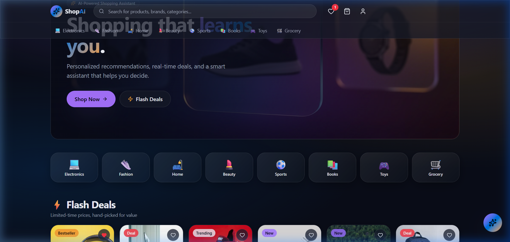
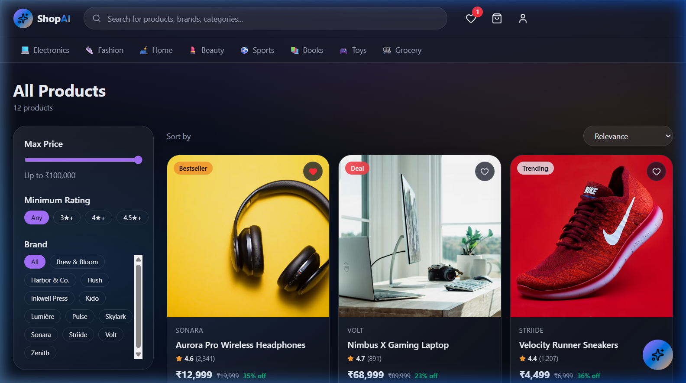

<div align="center">

# 🛍️ ShopAI — Smart Shopping, Personalized by AI

### An AI-powered e-commerce platform where a conversational assistant shops, adds to cart, and checks out — all for you.

[](https://react.dev)
[](https://tanstack.com/start)
[](https://vite.dev)
[](https://tailwindcss.com)
[](https://typescriptlang.org)
[](LICENSE)

<br/>



<br/>

[✨ Features](#-features) · [🤖 AI Assistant](#-ai-shopping-assistant) · [📸 Screenshots](#-screenshots) · [🛠️ Tech Stack](#️-tech-stack) · [🚀 Getting Started](#-getting-started) · [📁 Project Structure](#-project-structure) · [🤝 Contributing](#-contributing)

</div>

---

## ✨ Features

| Feature | Description |
|---|---|
| 🤖 **AI Shopping Assistant** | Conversational chatbot that understands natural language — say *"get me the best laptop and checkout"* and it handles everything |
| 🛒 **Automated Cart & Checkout** | AI adds products, saves your address, and navigates you to payment — zero manual steps |
| 🔍 **Smart Product Search** | Real-time search across products, brands, and categories with instant results |
| 🏷️ **Advanced Filters & Sorting** | Filter by price range, minimum rating, brand — sort by relevance, price, or top-rated |
| ⚡ **Flash Deals & Recommendations** | AI-curated product sections: trending, bestsellers, new arrivals, and personalized picks |
| 💜 **Wishlist Management** | Save products you love with one tap and come back to them anytime |
| 🛍️ **Full Checkout Flow** | Shipping address, UPI / Card / COD payment methods, order summary, and confirmation |
| 🎟️ **Coupon System** | Apply discount codes (try `SHOPAI25`) for instant savings |
| 👀 **Recently Viewed** | Automatic tracking of browsed products for easy re-discovery |
| 📱 **Fully Responsive** | Glassmorphic dark-theme UI that looks stunning on desktop, tablet, and mobile |
| 🔒 **Persistent State** | Cart, wishlist, and address persist across sessions via `localStorage` |
| ⚡ **SSR + Server APIs** | TanStack Start with server-side rendering and built-in API routes |

---

## 🤖 AI Shopping Assistant

The star of ShopAI — a **conversational AI chatbot** that doesn't just answer questions, it **takes action**.

<div align="center">

</div>

### What It Can Do

```
You say: "get me the best laptop"
→ AI picks the top-rated laptop from the catalog
→ Adds it to your cart automatically
→ Shows a confirmation with price

You say: "checkout"  
→ AI checks if shipping details are saved
→ If missing, asks for name, email, phone, address
→ Once complete, navigates you to the payment page
```

### Supported AI Actions

| Action | Example Prompt |
|---|---|
| **Add to Cart** | *"add running shoes"*, *"get me a good smartwatch"* |
| **Remove from Cart** | *"remove the headphones"* |
| **Clear Cart** | *"clear my cart"*, *"empty everything"* |
| **Save Address** | *"my name is John, email john@mail.com, phone 9876543210"* |
| **Go to Checkout** | *"checkout"*, *"pay now"*, *"complete my order"* |
| **Go to Cart** | *"show my cart"*, *"open cart"* |

### How It Works

```
┌─────────────┐     ┌──────────────┐     ┌─────────────────┐
│   User Chat  │────▶│  /api/chat   │────▶│  Gemini Flash AI │
│   Frontend   │◁────│  Server API  │◁────│   (or fallback)  │
└─────────────┘     └──────────────┘     └─────────────────┘
       │                    │
       │  Executes actions  │  Sends catalog + cart
       │  (add to cart,     │  context to AI
       │   navigate, etc.)  │
       ▼                    ▼
   ┌─────────┐      ┌──────────────┐
   │  Store   │      │  Product     │
   │ (Zustand │      │  Catalog     │
   │  Context)│      │  (12 items)  │
   └─────────┘      └──────────────┘
```

> **Works offline too!** — If no API key is configured, the chatbot falls back to a keyword-based demo mode that still understands commands like "laptop", "shoes", "headphones", and "checkout".

---

## 📸 Screenshots

<details open>
<summary><strong>🏠 Homepage — Hero, Categories & Flash Deals</strong></summary>
<br/>

<p><em>AI-powered hero banner, 8 product categories, flash deals, trending products, and AI recommendations — all on one page.</em></p>
</details>

<details>
<summary><strong>🛒 Products Page — Smart Filters & Sorting</strong></summary>
<br/>

<p><em>Browse 12+ products with real-time filters: price range slider, minimum rating, brand selection, and sort by relevance/price/rating.</em></p>
</details>

<details>
<summary><strong>📦 Product Detail — Specs, Reviews & Buy Now</strong></summary>
<br/>

<p><em>Full product page with image gallery, specifications table, quantity selector, Add to Cart / Buy Now buttons, wishlist, and similar product recommendations.</em></p>
</details>

<details>
<summary><strong>🤖 AI Chatbot — Automated Shopping Flow</strong></summary>
<br/>

<p><em>Ask ShopAI for any product → it selects the best match → adds to cart → navigates to checkout. Full end-to-end AI shopping in natural language.</em></p>
</details>

<details>
<summary><strong>💜 Wishlist — Save Products You Love</strong></summary>
<br/>

<p><em>Tap the heart on any product to save it. View all wishlisted items in one place with quick "Add to Cart" buttons.</em></p>
</details>

<details>
<summary><strong>🛒 Cart — Order Summary & Coupons</strong></summary>
<br/>

<p><em>Manage quantities, apply coupon codes, view order summary with subtotal, shipping, and total — then proceed to checkout.</em></p>
</details>

<details>
<summary><strong>💳 Checkout — Shipping & Payment</strong></summary>
<br/>

<p><em>Complete shipping address form, choose payment method (UPI, Card, or Cash on Delivery), review order summary, and place your order.</em></p>
</details>

<details>
<summary><strong>✅ Order Confirmation</strong></summary>
<br/>

<p><em>Beautiful order confirmation with unique order ID and options to continue shopping.</em></p>
</details>

---

## 🛠️ Tech Stack

| Layer | Technology |
|---|---|
| **Framework** | [TanStack Start](https://tanstack.com/start) (React meta-framework with SSR) |
| **Frontend** | [React 19](https://react.dev) + [TypeScript 5](https://typescriptlang.org) |
| **Routing** | [TanStack Router](https://tanstack.com/router) (file-based, type-safe) |
| **Styling** | [Tailwind CSS 4](https://tailwindcss.com) + custom glassmorphic design system |
| **Build Tool** | [Vite 7](https://vite.dev) |
| **AI Backend** | [Google Gemini Flash](https://deepmind.google/technologies/gemini/) via API gateway |
| **State** | React Context + `localStorage` persistence |
| **UI Components** | [Radix UI](https://www.radix-ui.com) primitives + [Lucide Icons](https://lucide.dev) |
| **Validation** | [Zod](https://zod.dev) (search params, schemas) |
| **Server** | [Nitro](https://nitro.build) (TanStack Start's server runtime) |

---

## 🚀 Getting Started

### Prerequisites

- **Node.js** ≥ 18
- **npm** or **bun** package manager
- (Optional) **Lovable API Key** for full AI chatbot functionality

### Installation

```bash
# Clone the repository
git clone https://github.com/your-username/smart-shop-ai.git
cd smart-shop-ai

# Install dependencies
npm install
# or
bun install
```

### Environment Variables

Create a `.env` file in the root directory:

```env
# Optional — enables full AI-powered chatbot with Gemini
# Without this, the chatbot runs in demo mode with keyword matching
LOVABLE_API_KEY=your_api_key_here
```

> **Note:** The app works perfectly without an API key! The AI chatbot will run in a smart fallback mode that understands keywords like "laptop", "shoes", "headphones", and "checkout".

### Run Development Server

```bash
npm run dev
```

The app will be available at **http://localhost:8080** 🚀

### Build for Production

```bash
npm run build
npm run preview
```

---

## 📁 Project Structure

```
smart-shop-ai/
├── src/
│   ├── assets/              # Static assets (hero image)
│   ├── components/
│   │   ├── Header.tsx        # Navigation bar with search, wishlist, cart
│   │   ├── Footer.tsx        # Site footer
│   │   ├── ProductCard.tsx   # Reusable product card component
│   │   ├── SectionRow.tsx    # Section layout wrapper
│   │   ├── ShopAI.tsx        # ⭐ AI Chatbot — the core feature
│   │   └── ui/              # Radix-based UI primitives
│   ├── hooks/
│   │   └── use-mobile.tsx    # Responsive breakpoint hook
│   ├── lib/
│   │   ├── products.ts       # Product catalog (12 products, 8 categories)
│   │   ├── store.tsx         # Global state (cart, wishlist, address)
│   │   ├── ai-gateway.server.ts  # AI API gateway config
│   │   └── utils.ts          # Utility functions
│   ├── routes/
│   │   ├── index.tsx         # 🏠 Homepage
│   │   ├── products.tsx      # 🛒 Products grid with filters
│   │   ├── products.$id.tsx  # 📦 Product detail page
│   │   ├── cart.tsx          # 🛒 Shopping cart
│   │   ├── checkout.tsx      # 💳 Checkout flow
│   │   ├── wishlist.tsx      # 💜 Wishlist
│   │   └── api/
│   │       └── chat.ts       # 🤖 AI Chat API endpoint
│   ├── router.tsx            # Router configuration
│   ├── styles.css            # Global styles & design tokens
│   └── start.ts              # App entry point
├── docs/screenshots/         # Demo screenshots
├── vite.config.ts            # Vite + TanStack configuration
├── tsconfig.json             # TypeScript configuration
├── package.json
└── README.md
```

---

## 🎨 Design System

ShopAI uses a custom **glassmorphic dark theme** built on Tailwind CSS 4 with:

- **Glass effects** — `backdrop-blur` with translucent backgrounds
- **Gradient borders** — Animated gradient outlines on key cards
- **Glow effects** — Subtle purple/blue glows on interactive elements
- **Color palette** — Deep navy backgrounds with vibrant purple/blue accents
- **Smooth animations** — Floating effects, scale transitions, pulse indicators
- **Responsive grid** — Adaptive layouts from mobile to ultrawide

---

## 🤝 Contributing

Contributions are welcome! Here's how to get started:

1. **Fork** the repository
2. **Create** a feature branch: `git checkout -b feature/amazing-feature`
3. **Commit** your changes: `git commit -m "Add amazing feature"`
4. **Push** to the branch: `git push origin feature/amazing-feature`
5. **Open** a Pull Request

### Development Guidelines

- Follow the existing code style (Prettier + ESLint configured)
- Use TypeScript for all new files
- Follow the component patterns in `src/components/`
- Test your changes across desktop and mobile viewports
- Run `npm run lint` before submitting

---

## 📄 License

This project is licensed under the **MIT License** — see the [LICENSE](LICENSE) file for details.

---

<div align="center">

**Built with ❤️ and AI**

[⬆ Back to Top](#️-shopai--smart-shopping-personalized-by-ai)

</div>
